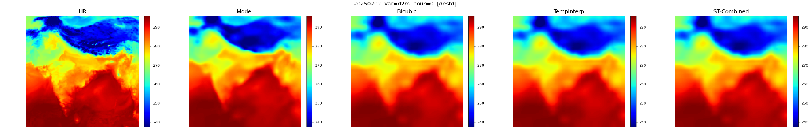
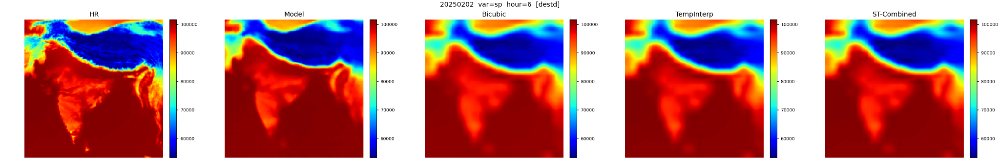
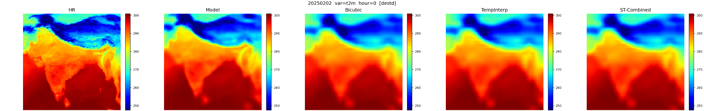
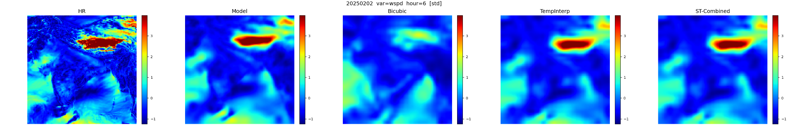

# GFS Upscaling with Factorized Super-Resolution

This repository contains a prototype deep learning pipeline for spatio-temporal

super-resolution of GFS forecast fields.

# Features

\- Factorized model with temporal (dilated 1D conv) + spatial (EDSR) upscaling

\- Training on standardized patches with temporal coherence loss

\- Baseline comparisons: bicubic, temporal spline, spatio-temporal

\- Full-field evaluation with SSIM/PSNR/RMSE/MAE metrics

\- Plotting and qualitative visualization of results

# Getting Started

\`\`\`bash

pip install -r requirements.txt

python train_factorized.py --data_root ../datasets/GFS --ckpt ./checkpoints/...

# Super-Resolution Prototype for GFS Upscaling

This document summarizes the approach, model architecture, training methodology, and results for a super-resolution prototype developed for GFS upscaling. The goal is to reconstruct high-resolution spatio-temporal fields from coarse-resolution inputs.

## Codebase Overview

**train_factorized.py:** Main training entry point. Builds dataloaders, constructs the factorized SR model, sets up the optimizer/scheduler, and launches training/validation (Lightning wrapper when available). Also wires in the temporal coherence loss (λ_dt).

**models/factorized_sr.py:** Model definition. Temporal upscaling via dilated 1D convolutions; spatial upscaling via EDSR-inspired residual blocks and pixel-shuffle layers.

**data/gfs_downscaling.py:** Data pipeline utilities. Loads NetCDF files, standardizes variables, and generates LR inputs by Gaussian blur + decimation (space) and sub-sampling (time). Provides patch extraction and splits.Also uses a handmade LRU cache function to prevent repeated redundant loading of data files and consequently boost efficiency.

**utils/trainer_factory.py:** Helper to instantiate the trainer, logging, callbacks, and LR schedule settings in a consistent way.

**utils/estimate_runtime.py:** Utility to estimate throughput/step time for typical patch sizes and batch configurations.

**callbacks/failfast_tuner.py:** Callback to quickly fail or adjust settings when divergence/NaNs are detected early in training.

**callbacks/throughput_callback.py:** Callback that measures iteration throughput and reports speed metrics during training.

**models/diffusion_sr.py:** Alternative/experimental SR model (diffusion-based). Not required for the factorized EDSR run but available for comparison.

These components work together as follows: data loading and LR/HR construction are provided by data/gfs_downscaling.py and consumed by train_factorized.py. The model architecture is defined in models/factorized_sr.py and imported into the trainer. Trainer utilities (utils/trainer_factory.py) configure the optimizer, learning-rate schedule, and callbacks. Optional callbacks in callbacks/ monitor training, and estimate_runtime.py assists in sizing experiments.

## Data Preprocessing

Low-resolution inputs are created from HR fields by spatial Gaussian filtering followed by decimation, and temporal sub-sampling (e.g., using every k-th frame). Inputs are standardized using per-variable means and standard deviations computed on the training set. To fit memory and boost stochasticity, the model is trained on small spatial patches randomly sampled from the domain while preserving temporal context.

## Model Architecture

The model is factorized into independent temporal and spatial upscalers. Temporal upscaling uses dilated 1D convolutions along the time axis to aggregate multi-scale temporal context efficiently. Spatial upscaling follows an EDSR-inspired design with residual blocks (without batch normalization) and pixel-shuffle layers to increase resolution. This simplicity yields a lightweight pipeline, but an evident limitation is the lack of explicit coupling between temporal and spatial upscaling, which can underutilize cross-dimension correlations.

## Training Strategy and Losses

Optimization is performed on standardized targets. The primary objective is a pixel loss (Huber or L1) applied to valid pixels only. In addition, a temporal coherence regularizer encourages frame-to-frame consistency by aligning the temporal differences of predictions to those of the ground truth:

L = L_pixel + λ_dt · L_dt  
L_pixel ∈ {Huber, L1}  
L_dt = mean \| (ŷ_t − ŷ\_{t−1}) − (y_t − y\_{t−1}) \|  
  
where λ_dt controls the strength of the temporal term (e.g., λ_dt ≈ 0.05 in the provided runs).

We use Adam/AdamW with weight decay, a cosine learning-rate schedule with warm-up, mixed precision, and gradient clipping. Validation loss drives checkpointing; optional SSIM/PSNR logging can be enabled.

## Results

We compare against three baselines: (1) spatial bicubic upsampling, (2) temporal interpolation via natural cubic splines, and (3) spatio-temporal interpolation (temporal interpolation plus spatial alignment). The model outperforms bicubic by all metrics and produces perceptually sharper features; however, pixelwise metrics can favor smoother methods like temporal interpolation when sharp structures shift slightly.

## Qualitative Examples

Selected examples (Order of images from left to right: HR, My Model, Bicubic, TempInterp, ST-Combined) for representative variables and lead times. Colorbars are shared across panels for comparability.

### Per-Variable Metrics (Standardized)

**\[STANDARD\] d2m**

| method      | RMSE     | MAE      | PSNR      | SSIM     |
|-------------|----------|----------|-----------|----------|
| model       | 0.230862 | 0.137155 | 24.889619 | 0.712387 |
| bicubic     | 0.917409 | 0.751752 | 12.879059 | 0.129723 |
| tempinterp  | 0.167388 | 0.102438 | 27.665447 | 0.773550 |
| st_combined | 0.167388 | 0.102438 | 27.665447 | 0.773550 |

**\[STANDARD\] r2**

| method      | RMSE     | MAE      | PSNR      | SSIM     |
|-------------|----------|----------|-----------|----------|
| model       | 0.459319 | 0.287869 | 18.847856 | 0.484937 |
| bicubic     | 1.007677 | 0.834453 | 11.991319 | 0.081749 |
| tempinterp  | 0.413005 | 0.266733 | 19.742703 | 0.549502 |
| st_combined | 0.413005 | 0.266733 | 19.742703 | 0.549502 |

**\[STANDARD\] sp**

| method      | RMSE     | MAE      | PSNR      | SSIM     |
|-------------|----------|----------|-----------|----------|
| model       | 0.305716 | 0.144342 | 22.337331 | 0.710937 |
| bicubic     | 0.915341 | 0.710767 | 12.810449 | 0.139016 |
| tempinterp  | 0.212093 | 0.111955 | 25.513131 | 0.767559 |
| st_combined | 0.212093 | 0.111955 | 25.513131 | 0.767559 |

**\[STANDARD\] t2m**

| method      | RMSE     | MAE      | PSNR      | SSIM     |
|-------------|----------|----------|-----------|----------|
| model       | 0.298554 | 0.166036 | 22.555167 | 0.650738 |
| bicubic     | 0.927433 | 0.736494 | 12.837891 | 0.115341 |
| tempinterp  | 0.278722 | 0.173914 | 23.161438 | 0.682373 |
| st_combined | 0.278722 | 0.173914 | 23.161438 | 0.682373 |

**\[STANDARD\] wspd**

| method      | RMSE     | MAE      | PSNR      | SSIM     |
|-------------|----------|----------|-----------|----------|
| model       | 0.611526 | 0.429768 | 16.347921 | 0.228904 |
| bicubic     | 0.969110 | 0.760831 | 12.497676 | 0.043875 |
| tempinterp  | 0.528598 | 0.374416 | 17.597092 | 0.299781 |
| st_combined | 0.528598 | 0.374416 | 17.597092 | 0.299781 |

### Per-Variable Metrics (De-standardized)

**\[DESTANDARD\] d2m**

| method      | RMSE      | MAE       | PSNR      | SSIM     |
|-------------|-----------|-----------|-----------|----------|
| model       | 3.634879  | 2.159485  | 22.552151 | 0.734232 |
| bicubic     | 14.444441 | 11.836205 | 10.541591 | 0.684657 |
| tempinterp  | 2.635498  | 1.612871  | 25.327979 | 0.792350 |
| st_combined | 2.635498  | 1.612871  | 25.327979 | 0.792350 |

**\[DESTANDARD\] r2**

| method      | RMSE      | MAE       | PSNR      | SSIM     |
|-------------|-----------|-----------|-----------|----------|
| model       | 11.502469 | 7.208943  | 17.944249 | 0.544071 |
| bicubic     | 25.234700 | 20.896738 | 11.087712 | 0.418746 |
| tempinterp  | 10.342660 | 6.679654  | 18.839096 | 0.613498 |
| st_combined | 10.342660 | 6.679654  | 18.839096 | 0.613498 |

**\[DESTANDARD\] sp**

| method      | RMSE         | MAE          | PSNR      | SSIM     |
|-------------|--------------|--------------|-----------|----------|
| model       | 5068.858701  | 2393.239023  | 19.600041 | 0.734220 |
| bicubic     | 15176.617334 | 11784.729633 | 10.073159 | 0.693431 |
| tempinterp  | 3516.571165  | 1856.245206  | 22.775841 | 0.791970 |
| st_combined | 3516.571165  | 1856.245206  | 22.775841 | 0.791970 |

**\[DESTANDARD\] t2m**

| method      | RMSE      | MAE      | PSNR      | SSIM     |
|-------------|-----------|----------|-----------|----------|
| model       | 4.049979  | 2.252325 | 21.932612 | 0.710230 |
| bicubic     | 12.580905 | 9.990758 | 12.215336 | 0.671786 |
| tempinterp  | 3.780948  | 2.359189 | 22.538883 | 0.760456 |
| st_combined | 3.780948  | 2.359189 | 22.538883 | 0.760456 |

**\[DESTANDARD\] wspd**

| method      | RMSE     | MAE      | PSNR      | SSIM     |
|-------------|----------|----------|-----------|----------|
| model       | 1.713899 | 1.204492 | 16.482788 | 0.328910 |
| bicubic     | 2.716085 | 2.132350 | 12.632543 | 0.240897 |
| tempinterp  | 1.481480 | 1.049362 | 17.731959 | 0.403731 |
| st_combined | 1.481480 | 1.049362 | 17.731959 | 0.403731 |

## Discussion and Recommendations

Qualitative inspection shows sharper gradients and mesoscale detail than baselines. Slightly lower RMSE/SSIM compared to temporal interpolation likely stems from spatially plausible but phase-shifted fine structures that pixelwise metrics penalize. For downstream tasks, sharper fields may be advantageous.

Incremental improvements:  
- Couple space and time via 3D convolutions or cross-attention.  
- Add gradient/edge or SSIM terms to the loss to balance fidelity and sharpness.  
- Introduce spectral or scale-aware losses; monitor spectra to match HR energy at small scales.  
- Evaluate with spatially tolerant scores (FSS, object-based metrics) alongside RMSE/SSIM.  
- Consider light U-Net/ViT backbones or a shallow diffusion decoder for enhanced textures.
